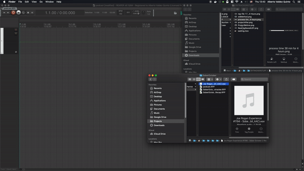
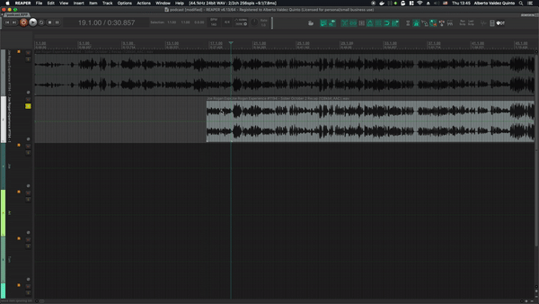
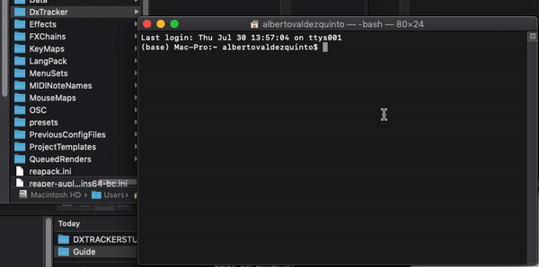
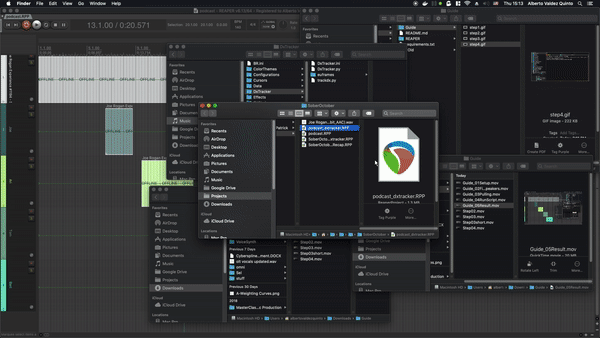

# DxTracker for Reaper (using Resemblyzer) 

## Description:

Find speakers in audio file using A.I. (Resemblyzer) and update your Reaper session.
https://github.com/resemble-ai/Resemblyzer

## Requirements:
- SoundFile==0.10.2
- numpy==1.18.5
- tqdm==4.47.0
- Resemblyzer==0.1.1.dev0
- reapy==0.0
- rpp==0.4

## Installation (Reaper):
1. Put contents of the REAPER folder in your Reaper Media folder. (Find it with: Options > Show REAPER resource path in explorer/finder)
2. Add new action, 'Load Reascript' and find 'DxTracker.py' that you just placed in your Reaper Media folder.
3. (Optional) Add it to a toolbar and use icon from the Data > toolbar_icons folder.

## Installation (Conda Environment)

## How to Use
Step 1: Setup your session for Guide Track and number of speakers (4 in this case)

Step2: Find Speakers/Dx in guide track and drag them to their respective Dx tracks.

Step3: Select all items to process, speakers and guide track.

Step4: Open Terminal and run trackdx.py in the DxTracker directory and the conda environment.

Step5: Once the script is done, open new project '_dxtracker.RPP'.

