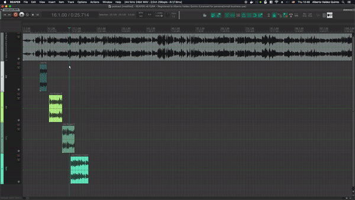

# DxTracker for Reaper (using Resemblyzer) 

Find speakers in audio file using A.I. (Resemblyzer) and update your Reaper session.

https://github.com/resemble-ai/Resemblyzer

## Requirements
- SoundFile==0.10.2
- numpy==1.18.5
- tqdm==4.47.0
- Resemblyzer==0.1.1.dev0
- reapy==0.0
- rpp==0.4

## Description

This script puts together tools for Reaper and modern A.I. implementations for voice recognition into a single workflow tool for identifying multiple speakers in an audio track and updating your Reaper project. It does it by getting the Embeded Utterance (EU) of each speaker and a set of EU frames for the guide track, then it compares all speakers with each frame using scalar/dot product in a mutually exclusive way. 

- Recommended duration for speaker sample is 5 to 30 seconds (> 10 is best). 
- The DxTracker.py script will pull data from Reaper and identify which items are mean to be speakers and which one is the guide track, as well as saving relevant project data in the DxTracker.ini file for the trackdx.py script to read.
- The EUF (Embeded Utterance Frames) for the guide track are stored on the 'euframes' folder as a .npy file for future runs.

## Installation (Reaper)

1. Put contents of the REAPER folder in your Reaper Media folder. (Find it with: Options > 'Show REAPER resource path in explorer/finder')
2. Add new action, 'Load Reascript' and find 'DxTracker.py' in your Reaper Media > DxTracker folder.
3. (Optional) Add it to a toolbar and use icon from the Data > toolbar_icons folder.

## Installation (Conda Environment)

(WIP) Explain how to install conda and make an environment for Resemblyzer

## Configuration

You can modify some values in DxTracker.ini 

`hoplength = 1` `framelength = 3` Granularity of Embeded Utterance Frames for guide track (in seconds).

`threshold = 0.9` The score/confidence threshold for returning a frame (ratio).

`overlapitems = True` Reaper, new project items can overlap between different Dx tracks (based on hop and frame length).

Other variables are meant for the project data.

## How to Use

Step 1: Setup your session for Guide Track and number of speakers (4 in this case)

Step2: Find Speakers/Dx in guide track and drag them to their respective Dx tracks.

Step3: Select all items to process (speakers and guide track).

Step4: Open Terminal and run trackdx.py in the DxTracker directory and the conda environment.

Step5: Once the script is done, open new project '_dxtracker.RPP'.

